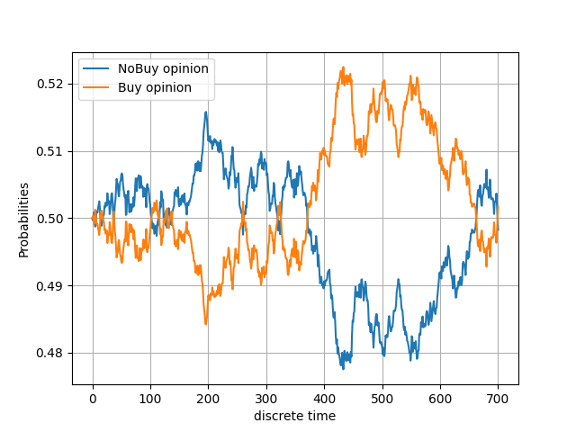
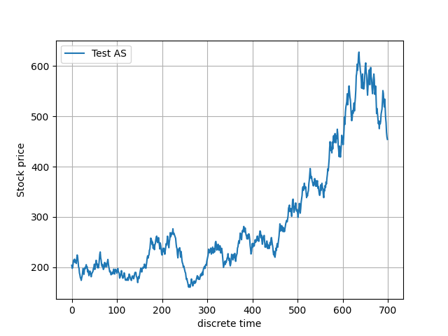

# StandardStockModel
This is a personal hobby project where I attempt to model market sentiment as a basis for evaluating stock prices. In addition, I’ve implemented tools for statistical analysis that help explore market behaviors.

Although I have no formal education in financial markets or capital management, they are a strong interest of mine. This interest began after reading Capital in the Twenty-First Century by French economist Thomas Piketty. My background is in theoretical physics, but I find economics to be just as intriguing!

## Model Overview
The core of this project is to model and understand the dynamics of market sentiment (or "opinion") and how it influences stock prices over time. The model is designed to capture key investor behaviors and market reactions using principles of stochastic processes, with a focus on how market sentiment evolves and its subsequent effect on asset valuation.

### Key Assumptions
A foundational assumption in financial theory, and one incorporated into this model, is that when market sentiment rises, it is typically because investors expect the underlying asset to increase in value. This expectation, in turn, drives more investors to buy the asset, further pushing up its price. The key behavior here is the feedback loop between sentiment and price: **positive sentiment** leads to **buying pressure**, which often results in a higher market price.

However, this assumption doesn't guarantee accuracy all the time. There are notable instances where investor expectations exceed actual asset performance, leading to overvaluation. The model accounts for this by incorporating stochastic elements — random fluctuations in market opinion and value — which means that while the asset’s price generally follows market sentiment, there is still room for volatility and deviations from expectations.

### Model Implementation
The core mechanics of the model are driven by stochastic differential equations (SDEs), which simulate the randomness inherent in financial markets. These equations are used to model both the evolution of **market sentiment** and the **asset price** over time. Specifically:

* **Market Sentiment (Opinion):**
 This is modeled as a time-dependent stochastic process, representing how investor confidence or expectations about the asset change over time. It can fluctuate based on various factors, such as market news, external economic conditions, or investor psychology. The sentiment typically trends upward when the asset is perceived to perform well, but short-term fluctuations are common.

* **Asset Value:** The asset’s market value is modeled in relation to the evolving market sentiment. As sentiment improves, the price tends to rise due to increased demand. However, random perturbations can cause the price to deviate from this general trend, reflecting real-world market volatility where expectations don't always align with outcomes.

The interaction between these two variables allows for emergent behaviors that are often observed in real financial markets, such as bubbles (when prices inflate based on overly optimistic sentiment) or corrections (when prices fall despite strong sentiment due to external factors).

Model Output and Interpretation
The output of the model provides insights into how market sentiment and asset prices co-evolve. Below, you will find two visualizations produced by the model:

### Figure 1 – Market Sentiment Over Time:
 This figure shows the evolution of the market’s opinion about the asset. The sentiment generally rises due to investor optimism but exhibits random fluctuations that reflect market uncertainties and external factors influencing investor confidence.

### Figure 2 – Asset Price Over Time:
 The second figure displays the corresponding evolution of the asset’s market value. As expected, the price tends to increase in line with rising market sentiment. However, stochastic variance introduces short-term unpredictability, highlighting the possibility of price corrections or overshoots driven by market sentiment volatility.

In these figures, the behavior aligns with typical market dynamics: as sentiment improves, the asset price climbs. However, the model also captures the inherent uncertainty, allowing for rare but possible scenarios where prices deviate from expectations, such as sudden drops in value.

## Further Considerations
The model is flexible and open to further refinement. Future improvements may include adding more complex behavioral dynamics, such as feedback loops between asset performance and sentiment, or incorporating external factors like macroeconomic indicators (e.g., interest rates, inflation) that can also influence market sentiment and asset prices.

Additionally, the model currently assumes that deviations from expected outcomes are relatively rare, driven by randomness. However, exploring mechanisms that could lead to more systematic deviations, such as herd behavior, panic selling, or regulatory interventions, could provide deeper insights into market volatility and crashes.

## Goals
The primary goal of this project is to develop tools and methods based on the hypothesis that stock prices and investor behavior are heavily influenced by market sentiment. After all, the value of any asset is ultimately determined by what people are willing to pay for it. Therefore, being able to model market sentiment and its potential impact on stock prices is a valuable and intriguing challenge.

Additionally, I aim to build systems that can generate data on demand, enabling the use of statistical and numerical methods for analysis. For example, it may be possible to create a logistic regression model using parameters based on market sentiment and stock price data as inputs, in order to predict whether an investor should buy or sell a financial asset based on certain conditions.

### Possible additional goals
Additional concrete goals for the project are presented in the following list.

1. **Incorporate Real-World Market Data**
* **Goal:** Integrate real stock market data into the model to compare simulated market sentiment with real-world trends.
* **Why:** This would allow you to validate your model by seeing how well it predicts actual market behavior. You could also use real-world data to fine-tune the model and improve its accuracy.

2. **Enhance the Complexity of Market Sentiment**
* **Goal:** Introduce more complex variables into the model, such as news sentiment analysis, macroeconomic indicators (interest rates, inflation), or industry-specific trends.
* **Why:** Real market sentiment is influenced by a wide range of factors beyond just investor speculation. Incorporating additional data points could lead to more realistic and nuanced predictions.

3. **Incorporate Machine Learning Models**
* **Goal:** Implement machine learning algorithms (e.g., random forests, neural networks) to predict market sentiment and price changes.
* **Why:** Using advanced ML techniques could improve the predictive accuracy of your model and enable it to capture non-linear relationships that traditional statistical methods might miss.

4. **Simulate Extreme Market Events**
**Goal:** Model extreme market scenarios (e.g., crashes, bubbles, or unexpected shocks) to study how sentiment evolves during periods of high volatility.
**Why:** Markets behave very differently during times of crisis, and simulating these events could provide insight into investor behavior during periods of stress and how well the model adapts to abnormal conditions.

5. **Create a Sentiment-Driven Trading Strategy**
* **Goal:** Develop an algorithmic trading strategy based on the model’s market sentiment predictions, testing its performance under different market conditions.
* **Why:** This could provide practical value by offering an insight into whether market sentiment can reliably be used as part of a real-world trading strategy.

6. **Explore Behavioral Finance Elements**
* **Goal:** Integrate elements of behavioral finance, such as herd behavior, overconfidence, or panic selling, to see how they influence market sentiment and prices in the model.
* **Why:** Behavioral factors can significantly affect market outcomes, and incorporating these would enhance the realism of your model and allow you to explore psychological impacts on pricing.

7. **Implement Multi-Asset Modeling**
* **Goal:** Expand the model to simulate a portfolio of assets and observe how sentiment about one asset might influence others (e.g., contagion effect).
* **Why:** Many financial models are based on interrelated assets, where the performance or sentiment about one stock or sector affects others. This could be useful for portfolio management and risk assessment.
8. **Visualize Market Sentiment Over Time**
* **Goal:** Develop an advanced data visualization dashboard that tracks market sentiment and price evolution in real-time or over simulated time periods.
* **Why:** A rich visualization tool could make it easier to analyze patterns, identify trends, and present the model's findings in an intuitive, user-friendly manner.

9. **Optimize Model Parameters for Prediction Accuracy**
* **Goal:** Systematically optimize the model’s parameters (such as the weight of market sentiment, volatility, etc.) to maximize its predictive accuracy using techniques like grid search or genetic algorithms.
* **Why:** Optimizing the model’s underlying assumptions and parameters can significantly improve its real-world applicability and help fine-tune it for different market environments.

10. **Develop a Risk Management Tool**
* **Goal:** Extend the model to provide risk metrics (e.g., Value at Risk (VaR), Sharpe Ratio) based on the predicted stock prices and sentiment trends.
* **Why:** Investors and financial institutions could use these metrics to evaluate the risk associated with holding certain stocks, providing another practical application of your model.

## Why develop a data-generation model when there is so much data out there already?
Given the vast amount of stock market data available, one might wonder why the **StandardStockModel** is necessary. There are two main reasons for developing it:

* **Personal Learning and Growth:** Developing this model allows me to dive deeper into financial theory, statistics, and Python programming. By building the model myself, I gain practical experience and a better understanding of how to implement these concepts.

* **A Testing Ground for Hypotheses:** The **StandardStockModel** serves as a sandbox for experimenting with different ideas. It provides a controlled environment to test how market sentiment might evolve and how it could affect stock prices, without being constrained by the noise and unpredictability of real-world data. This makes it a powerful tool for exploring new hypotheses and refining existing ones.

## Current Methods

As the project is still in its early stages, the code currently has limited functionality, consisting of two primary classes, which are detailed below.

All methods operate in discrete time steps, with the model iterating through each time step to update the **market opinion (MO)** of the financial asset in question. Below, I provide a brief overview of how the model evolves over time. It’s worth noting that some assumptions have been made for simplicity, and these may need to be revised as the model's complexity increases.

At time $t = i$, the cumulative market opinion (CMO) of the asset is represented by $O_i$, which reflects the market's belief about whether the asset will appreciate. At the next time step $t = i + 1$, the CMO may change, driven by some external event or remain relatively stable. This process models real-world events or news that impact the stock's value. For example, a change in the Baltic Dry Index (BDI) might affect the market's opinion of a shipping asset, while a tweet from a high-profile figure like Elon Musk could have a dramatic impact. 

In the model, such events are abstracted by drawing a value $X$ from a probability distribution, $X \sim P(\vec{\theta})$, where $\vec{\theta}$ represents the parameters of the distribution. The CMO is then updated as:

$$ O_{i+1} = O_i + X $$

Because market opinion typically shifts gradually and continuously, selecting an appropriate probability distribution is critical. There should be a low, but non-zero, probability of larger jumps in opinion, reflecting rare but impactful events. Historical examples, like the rapid sentiment changes following Elon Musk's tweets or the sharp rise of companies like Nvidia and GameStop, demonstrate that large shifts can indeed happen.

Next, the model updates the asset price. At time $t = i$, the asset price is denoted by $\mathcal{V}_i$. A change in price, $d\mathcal{V}$, is drawn from a price distribution $P_c(\rho)$. The direction of the price change is determined by a multiplicative factor, $\eta$, which can be either 1 (indicating an increase) or -1 (indicating a decrease). The probability $P_u$ that $\eta = 1$ (price increases) is directly linked to the market opinion at time $i$, such that $P_u = O_i$. Consequently, the probability of a price decrease is $P_d = 1 - O_i$, as the probabilities must sum to one. The asset price is then updated using the formula:

$$ \mathcal{V}_{i+1} = \mathcal{V}_i + \eta d\mathcal{V} $$

This process is repeated for as many cycles as specified, iterating over each time step.

Currently, the change in price is modeled using a simple probability distribution, as there are many factors that can influence price fluctuations. For instance, limited trading volume could affect the price if current asset holders are unwilling to sell, prompting buyers to raise their bids. Other factors, like market liquidity and demand, also play a role. For now, I have chosen values that seem reasonable, but future work will involve calibrating these parameters with real-world data. Another improvement on the horizon is to merge the variables $C$ and $\eta$ into a single parameter, which would be drawn from a probability distribution influenced by $O_i$.

## Classes Overview

Currently, the codebase features two primary classes: **MarketOpinionModel** and **StandardStockModel**. The **MarketOpinionModel** class is responsible for modeling the cumulative market opinion (CMO), while the **StandardStockModel** class handles the evolution of the asset value over time. Importantly, the **StandardStockModel** class is a subclass of **MarketOpinionModel**, meaning it inherits all of the functionality of the **MarketOpinionModel** and adds further features for modeling stock price behavior.

### The `MarketOpinionModel` Class

This class simulates the cumulative market opinion (CMO) of a financial asset, based on external market factors. It relies on a Gaussian distribution to update the opinion at each time step, with the distribution's parameters controlled by the input arguments:

- **Inputs:**
  - `volatility`: Controls the level of market volatility, with values 0, 1, and 2 signifying increasing levels of variance in the Gaussian distribution. Higher values represent greater fluctuations in market opinion.
  - `mu`: Specifies the median of the Gaussian distribution, which sets the central tendency of market opinion changes.

#### `Set_mu_by_sigma`
- **Input:** `percentage` - Adjusts the median of the Gaussian distribution to a specified percentage of the standard deviation.
  
#### `Init_MarketOpinion`
- **Input:** `positive` - Initializes the cumulative market opinion (CMO), setting it to a value between 0 and 1 at the start of the simulation ($O_0$ at $t = 0$).

#### `set_evolver`
- **Input:** `evolver` - Defines the method used to evolve the asset value.
  - `"G"` uses the `Gaussian_MarketOpinion_evolver`.
  - `"AG"` uses the `Adaptive_Gaussian_MarketOpinion_evolver`.

This function selects which of the two available methods will update the market opinion.

#### `Gaussian_MarketOpinion_evolver`
- **Input:** `nrcycles` (default = 1) - Defines the number of cycles (iterations) for which the method should run.
  
This method evolves the market opinion over time by:
1. Drawing a value $X$ from a Gaussian distribution $X \sim P(\mu, \sigma)$.
2. Updating the market opinion as follows: if $0 < O_i + X < 1$, then $O_{i+1} = O_i + X$; otherwise, $O_{i+1} = O_i$.

#### `mu_updater`
- **Input:** `regulator` (default = 2) - Adjusts the median of the Gaussian distribution over time.

This function is a part of the `Adaptive_Gaussian_MarketOpinion_evolver`. It allows the median ($\mu$) to adapt dynamically based on market conditions. The steps are:

1. $\mu$ is halved: $\mu = \mu / 2$.
2. A value $\Delta\mu$ is drawn from a predefined probability distribution $P(\theta)$, representing the percentage shift of $\mu$ relative to the standard deviation ($\sigma$).
3. A direction $\eta$ is drawn from a discrete distribution, where $P(\{1\}) = 0.5$ and $P(\{-1\}) = 0.5$.
4. The median is updated: $\mu = \mu + \eta \Delta\mu \sigma$.

**Note:** The adaptive $\mu$ models how human market behavior might adjust based on news or other events. Positive news may gradually raise market sentiment before stabilizing, reflecting how opinions tend to react to new information over time. This aspect still requires further optimization, particularly in refining the distributions $P(\theta)$ and $P(\eta)$.

#### `Adaptive_Gaussian_MarketOpinion_evolver`
- **Input:** `nrcycles` (default = 1) - Specifies how many cycles the method runs.

This method works similarly to the `Gaussian_MarketOpinion_evolver`, but with an adaptive median:
1. A value $X$ is drawn from a Gaussian distribution $X \sim P(\mu, \sigma)$.
2. If $0 < O_i + X < 1$, then $O_{i+1} = O_i + X$; otherwise, $O_{i+1} = O_i$.
3. The median $\mu$ is updated using the `mu_updater` function.

#### `plot_probs`
- **Inputs:** 
  - `save`: (default = 0) - If set to 1, saves the generated plot in the `figs/` directory.
  - `name`: (default = "1") - The filename to save the plot as, with a ".png" extension.

This function generates and optionally saves a plot that visualizes the cumulative market opinion (CMO) over discrete time steps.

#### 'muplot'
- **Inputs**
    - `save`: (default = 0) - If set to 1, saves the generated plot in the `figs/` directory.
    - `name`: (default = "1") - The filename to save the plot as, with a ".png" extension.

This function plots $\mu$ as a function of discrete time. **Note:** This method only works if the evolver is using AGMOE.

### The `StandardStockModel` Class

The **StandardStockModel** class is responsible for simulating the evolution of a financial asset's value over time. It builds on the **MarketOpinionModel** class by incorporating asset price dynamics alongside market opinion evolution.

- **Inputs:**
  - `InitValue`: Sets the initial value of the financial asset.
  - `volatility`: Controls the level of volatility, passed from the **MarketOpinionModel** class to adjust the variance of the market opinion updates.
  - `mu`: Sets the median of the Gaussian distribution used in the **MarketOpinionModel** class for updating the cumulative market opinion (CMO).

#### `price_time_evolve`
- **Input:** `priceCycles` (default = 1) - Specifies how many iterations (cycles) the method should run.

This method simulates the asset price evolution over discrete time steps. The process works iteratively as follows:

1. A value change, $dV$, is selected from a predefined probability distribution, $dV \sim P(\{0.01, 0.02, 0.03, 0.04, 0.05\})$, with the following probabilities:
   - $P(\{0.01\}) = 0.2$
   - $P(\{0.02\}) = 0.3$
   - $P(\{0.03\}) = 0.3$
   - $P(\{0.04\}) = 0.1$
   - $P(\{0.05\}) = 0.1$
   
2. A direction factor, $\eta$, is chosen from a discrete distribution $\eta \sim P(\{1, -1\})$, where both 1 (indicating an increase in price) and -1 (indicating a decrease) have equal probability (50%).

3. The asset value is updated as follows: 

$$ \mathcal{V}_{i+1} = \mathcal{V}_i + \eta d\mathcal{V} $$

This process repeats for the number of cycles specified by the `priceCycles` argument, simulating changes in the asset price over time based on stochastic changes in both magnitude ($dV$) and direction ($\eta$).

**Potential Improvements:**
The current method uses a simple, fixed probability distribution to select $d\mathcal{V}$. A possible improvement could be to explore other distributions, such as a Poisson distribution or an exponentially decaying function, to better reflect real-world asset price behavior. Additionally, combining $\eta$ and $d\mathcal{V}$ into a single parameter that is drawn from one distribution could lead to a more cohesive model.

#### `plot_stonks`
- **Inputs:**
  - `save`: (default = 0) - If set to 1, the plot will be saved to the `figs/` folder.
  - `name`: (default = "1") - Specifies the filename for the saved plot, with a ".png" extension.

This method generates and optionally saves a plot that shows the asset's value as a function of discrete time steps, providing a visual representation of the asset's price evolution.

## Further Development

* **Integrate the GARP Strategy:** Implement the requirements of the Growth at a Reasonable Price (GARP) strategy to enhance investment decision-making.

* **Enhance Event Chains in Market Opinion Models:** Develop a more realistic event-chain framework that incorporates factors such as quarterly earnings reports and other significant market events that influence market opinion.

* **Refine Probability Values:** Update the probability distributions used in the methods to reflect more realistic scenarios. This will involve sourcing appropriate values from extensive datasets of real-world financial assets to ensure accuracy.

* **Create a Statistics Analysis Class:** Develop a dedicated class for statistical analysis to facilitate deeper insights into market behavior and model performance.

* **Build an Agent-Based Trading System:** Implement an agent-based trading system to facilitate dynamic price updates, simulating real-world trading behaviors and decisions.

